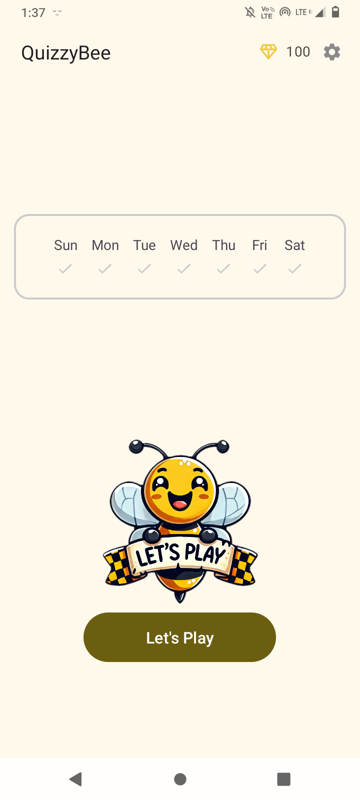
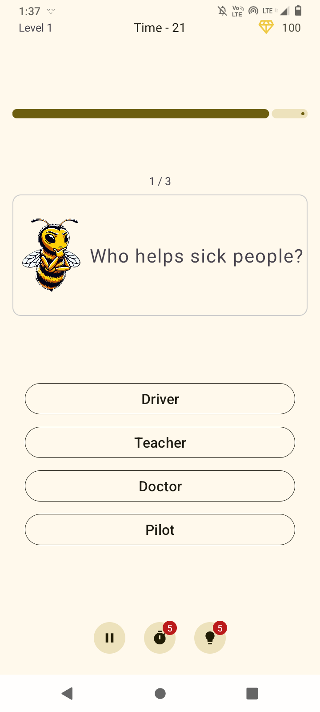
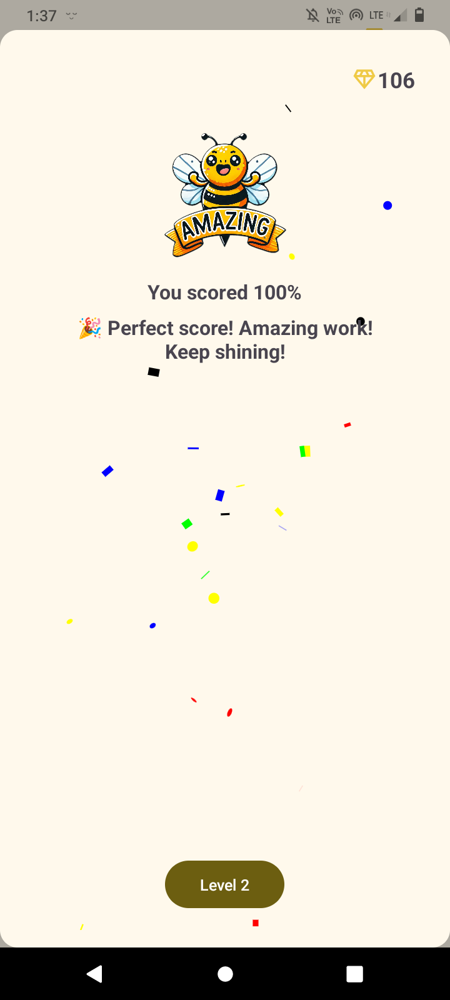
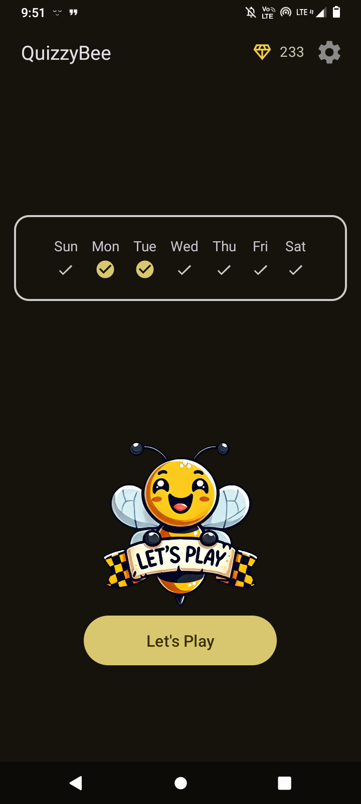
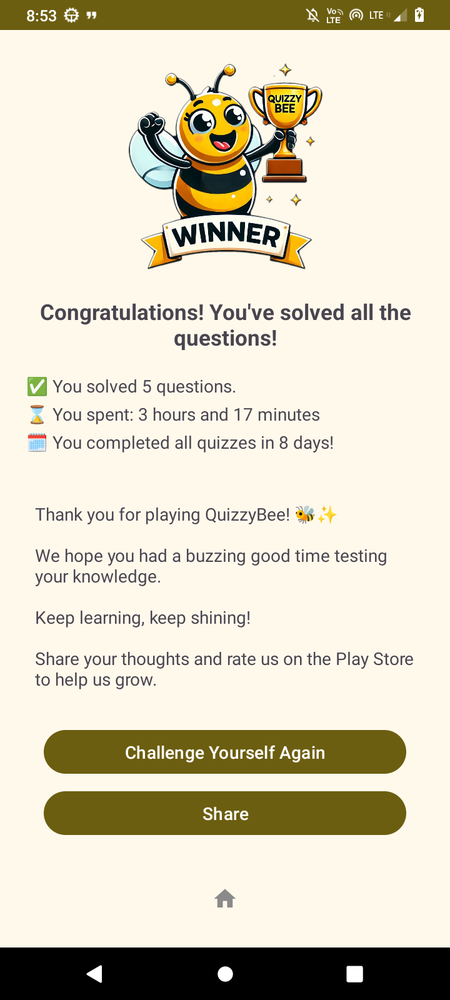
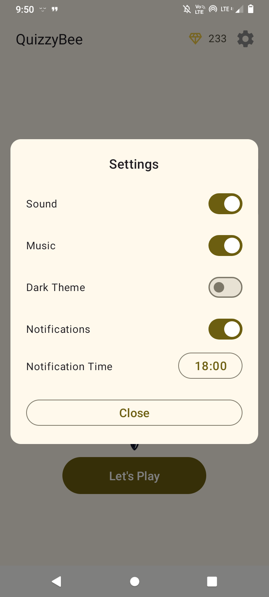

# 🐝 QuizzyBee - English Quiz App

QuizzyBee is a fun and interactive English quiz app designed for **beginner to intermediate** learners. It helps users improve their vocabulary and grammar through multiple-choice quizzes.

## 📸 Screenshots
  

  

## ✨ Features

✅ **Multiple-Choice Questions** – Each question has four options, making learning engaging.  
✅ **Level System** – Progress through levels by answering questions correctly.  
✅ **Coin Rewards** – Earn coins for correct answers and use them for hints.  
✅ **Streak Tracking** – Keep your daily learning streak going!   
✅ **Lightweight & Fast** – Optimized performance with Room database storage.  

## 📱 Tech Stack

- **Android (Kotlin)**
- **MVVM Architecture**
- **Jetpack Components** (ViewModel, LiveData, Room)
- **ProGuard & R8** (for app optimization)
- **Moshi** (for JSON parsing)
- **View Binding** (for UI interactions)
